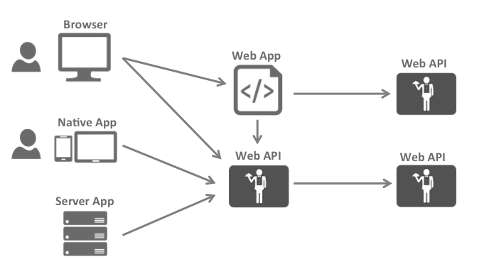

大图
===============

大多数现代应用程序看起来或多或少是这样的：

最常见的交互是：

* 浏览器与 Web 应用程序通信

* Web 应用程序与 Web API 通信（有时是自己通信，有时是代表用户通信）

* 基于浏览器的应用程序与 Web API 通信

* 原生应用程序与 Web API 通信

* 基于服务器的应用程序与 Web API 通信

* Web API 与 Web API 通信（有时是自己通信，有时是代表用户通信）

通常，每一层（前端、中间层和后端）都必须保护资源并实施身份验证和/或授权 —— 通常针对同一个用户存储。

将这些基本的安全功能外包给安全令牌服务可以防止在这些应用程序和端点之间复制该功能。

重构应用程序以支持安全令牌服务会导致以下架构和协议：

.. image:: images/protocols.png

这样的设计将安全问题分为两部分：

验证
^^^^^^^^^^^^^^
当应用程序需要知道当前用户的身份时，就需要进行身份验证。
通常，这些应用程序代表该用户管理数据，并且需要确保该用户只能访问他被允许访问的数据。
最常见的例子是（典型的）Web 应用程序 – 但是原生和基于 JS 的应用程序也需要身份验证。

最常见的身份验证协议是 SAML2p、WS-Federation 和 OpenID Connect —— SAML2p 是最流行和最广泛部署的。

OpenID Connect 是三者中最新的，但被认为是未来，因为它在现代应用程序中最有潜力。它从一开始就是为移动应用场景而构建的，旨在对 API 友好。

API 访问
^^^^^^^^^^
应用程序有两种与 API 通信的基本方式 – 使用应用程序标识，
或委托用户的身份。有时需要将这两种方法结合起来。

OAuth2 是一种允许应用程序从安全令牌服务请求访问令牌并使用它们与 API 通信的协议。这种委托降低了客户端应用程序和 API 的复杂性，因为身份验证和授权可以集中。

OpenID Connect 和 OAuth 2.0 – 更好地结合在一起
^^^^^^^^^^^^^^^^^^^^^^^^^^^^^^^^^^^^^^^^^^^^^^
OpenID Connect 和 OAuth 2.0 非常相似 – 事实上，OpenID Connect 是 OAuth 2.0 之上的扩展。
两个基本的安全问题，身份验证和 API 访问，被组合成一个单一的协议 - 通常与安全令牌服务的单次往返。 

我们相信 OpenID Connect 和 OAuth 2.0 的结合是在可预见的未来保护现代应用程序的最佳方法。IdentityServer4 是这两种协议的一个实现，并且经过高度优化，可以解决当今移动、原生和 Web 应用程序的典型安全问题。

IdentityServer4 如何提供帮助
^^^^^^^^^^^^^^^^^^^^^^^^^^^^
IdentityServer 是将符合规范的 OpenID Connect 和 OAuth 2.0 端点添加到任意 ASP.NET Core 应用程序的中间件。

通常，您构建（或重用）一个包含登录和注销页面的应用程序（可能还包含同意页面 - 取决于您的需求），并且 IdentityServer 中间件向其中添加了必要的协议头，以便客户端应用程序可以使用那些标准协议与之对话。

.. image:: images/middleware.png

托管应用程序可以任意复杂，但我们通常建议通过仅包含与身份验证相关的 UI 来尽可能地减少攻击面。
