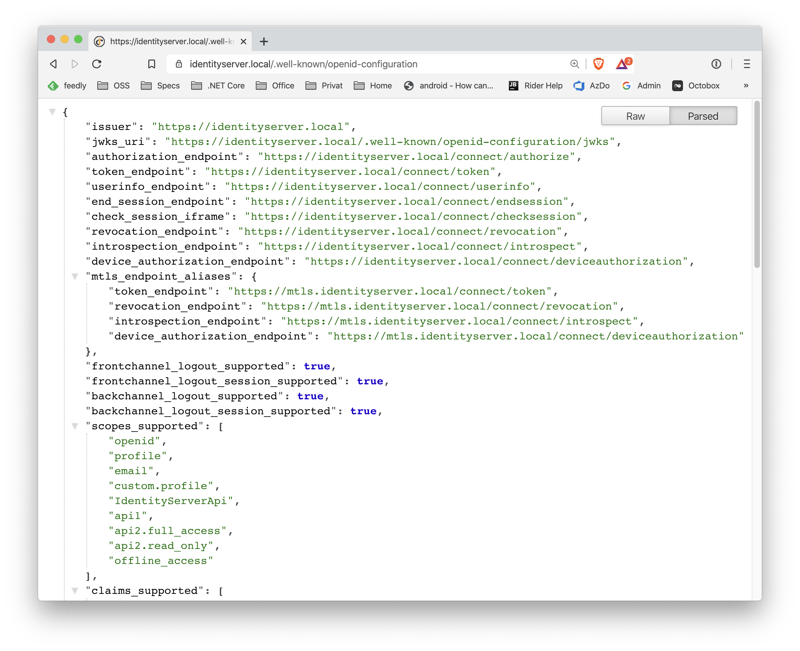
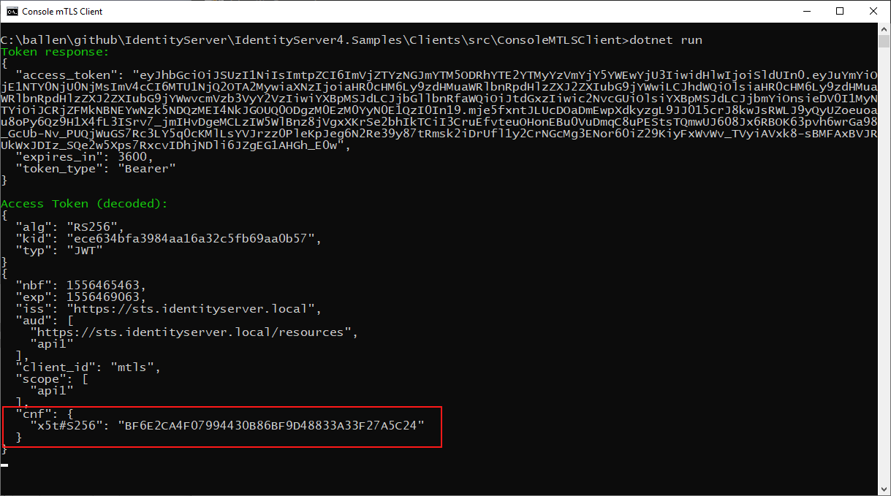

.. _refMutualTLS:
Mutual TLS
==========
IdentityServer 中的双向 TLS 支持允许两个功能：

* 使用 TLS X.509 客户端证书对 IdentityServer 端点进行客户端身份验证
* 使用 TLS X.509 客户端证书将访问令牌绑定到客户端

.. Note:: 有关更多信息，请参阅 `“OAuth 2.0 Mutual-TLS 客户端身份验证和证书绑定访问令牌” <https://tools.ietf.org/html/rfc8705>`_ 规范

设置 MTLS 涉及几个步骤。

服务器设置
^^^^^^^^^^^^
托管层有责任对客户端证书进行实际验证。
IdentityServer 然后将使用该信息将证书与客户端相关联，并将证书信息嵌入到访问令牌中。

根据您使用的服务器，这些步骤是不同的。 有关更多信息，请参阅 `此 <https://leastprivilege.com/2020/02/07/mutual-tls-and-proof-of-possession-access-tokens-part-1-setup/>`_ 博客文章。

.. Note:: `mkcert <https://github.com/FiloSottile/mkcert>`_ 是一个很好的工具，用于为开发目的创建证书。

ASP.NET Core 设置
^^^^^^^^^^^^^^^^^^
根据服务器设置，ASP.NET Core 主机接收客户端证书的方式不同。 而对于 IIS 和纯 Kestrel 托管，没有额外的步骤，
通常，您在应用程序服务器前面有一个反向代理。

这意味着除了典型的转发头处理之外，您还需要处理包含客户端证书的头。
为此，在中间件管道的开头添加对 ``app.UseCertificateForwarding();`` 的调用。

代理传输证书的确切格式没有标准化，这就是为什么您需要注册一个回调来进行实际的标头解析。
Microsoft `文档 <https://docs.microsoft.com/en-us/aspnet/core/security/authentication/certauth?view=aspnetcore-3.1>`_ 展示了 Azure Web 应用程序如何工作。

如果您使用的是 Nginx（我们发现它是最灵活的托管选项），您需要在 ``ConfigureServices`` 中注册以下服务

    services.AddCertificateForwarding(options =>
    {
        // 标头名称可能会有所不同，具体取决于您的 nginx 配置
        options.CertificateHeader = "X-SSL-CERT";

        options.HeaderConverter = (headerValue) =>
        {
            X509Certificate2 clientCertificate = null;

            if(!string.IsNullOrWhiteSpace(headerValue))
            {
                var bytes = Encoding.UTF8.GetBytes(Uri.UnescapeDataString(headerValue));
                clientCertificate = new X509Certificate2(bytes);
            }

            return clientCertificate;
        };
    });

一旦加载了证书，您还需要设置身份验证处理程序。
在这种情况下，我们希望支持自签名证书，因此是 ``CertificateType.All`` 并且没有吊销检查。
这些设置在您的环境中可能会有所不同:: 

    services.AddAuthentication()
        .AddCertificate(options =>
        {
            options.AllowedCertificateTypes = CertificateTypes.All;
            options.RevocationMode = X509RevocationMode.NoCheck;
        });

IdentityServer setup
^^^^^^^^^^^^^^^^^^^^
下一步是在 IdentityServer 中启用 MTLS。 为此，您需要指定您在最后一步中设置的证书身份验证处理程序的名称（默认为 ``Certificate``），
和 MTLS 托管策略。

在 IdentityServer 中，双向 TLS 端点可以通过三种方式配置（假设 IdentityServer 在 ``https://identityserver.io`` 上运行：

* 基于路径 - 位于路径 ``~/connect/mtls`` 下的端点，例如 ``https://identityserver.io/connect/mtls/token``。
* 基于子域名 - 端点位于主服务器的子域名上，例如 ``https://mtls.identityserver.io/connect/token``。
* 基于域名 - 端点位于不同的域名中，例如 ``https://identityserver-mtls.io``。  

例如::

    var builder = services.AddIdentityServer(options =>
    {
        options.MutualTls.Enabled = true;
        options.MutualTls.ClientCertificateAuthenticationScheme = "Certificate";
        
        // 使用子域名托管
        options.MutualTls.DomainName = "mtls";
    });

IdentityServer 的发现文档反映了这些端点：

客户端认证
^^^^^^^^^^^^^^^^^^^^^
客户端可以使用 X.509 客户端证书作为 IdentityServer 中端点的身份验证机制。

为此，您需要将客户端证书与 IdentityServer 中的客户端相关联。
使用 :ref:`IdentityServer builder <refStartup>` 将服务添加到 DI，其中包含一个默认实现来执行基于指纹或通用名称的操作::

    builder.AddMutualTlsSecretValidators();

最后，对于 :ref:`client 配置 <refClient>` 添加到 ``ClientSecrets`` 集合的机密类型为 ``SecretTypes.X509CertificateName``。
如果您希望通过证书识别名验证客户端，或者 ``SecretTypes.X509CertificateThumbprint`` 如果您希望通过证书指纹验证客户端。

例如::

    new Client
    {
        ClientId = "mtls",
        AllowedGrantTypes = GrantTypes.ClientCredentials,
        AllowedScopes = { "api1" }
        ClientSecrets = 
        {
            // 基于名称
            new Secret(@"CN=mtls.test, OU=ROO\ballen@roo, O=mkcert development certificate", "mtls.test")
            {
                Type = SecretTypes.X509CertificateName
            },
            // 或基于指纹
            //new Secret("bca0d040847f843c5ee0fa6eb494837470155868", "mtls.test")
            //{
            //    Type = SecretTypes.X509CertificateThumbprint
            //},
        },
    }

使用客户端证书对 IdentityServer 进行身份验证
~~~~~~~~~~~~~~~~~~~~~~~~~~~~~~~~~~~~~~~~~~~~~~~~~~~~~~~~~~~~
编写客户端以连接到 IdentityServer 时，``SocketsHttpHandler``（或 ``HttpClientHandler`` 如果您使用的是较旧的 .NET Framework 版本）
类提供了一种方便的机制来将客户端证书添加到传出请求中。

然后使用 HttpClient 进行 HTTP 调用（包括使用各种 `IdentityModel <https://github.com/IdentityModel/IdentityModel2>`_ 扩展方法）
将在 TLS 通道上执行客户端证书认证。

例如::

    static async Task<TokenResponse> RequestTokenAsync()
    {
        var handler = new SocketsHttpHandler();
        var cert = new X509Certificate2("client.p12", "password");
        handler.SslOptions.ClientCertificates = new X509CertificateCollection { cert };

        var client = new HttpClient(handler);

        var disco = await client.GetDiscoveryDocumentAsync(Constants.Authority);
        if (disco.IsError) throw new Exception(disco.Error);

        var response = await client.RequestClientCredentialsTokenAsync(new ClientCredentialsTokenRequest
        {
            Address = disco
                            .TryGetValue(OidcConstants.Discovery.MtlsEndpointAliases)
                            .Value<string>(OidcConstants.Discovery.TokenEndpoint)
                            .ToString(),
                            
            ClientId = "mtls",
            Scope = "api1"
        });

        if (response.IsError) throw new Exception(response.Error);
        return response;
    }

发送方受限访问令牌
^^^^^^^^^^^^^^^^^^^^^^^^^^^^^^^^
每当客户端使用客户端证书向 IdentityServer 进行身份验证时，该证书的指纹将嵌入访问令牌中。

在对 API 进行身份验证时，客户端可以使用 X.509 客户端证书作为发送方受限访问令牌的机制。
使用这些受发送方约束的访问令牌要求客户端使用与 IdentityServer 相同的 X.509 客户端证书对 API 进行身份验证。

确认声明
~~~~~~~~~~~~~~~~~~
当客户端获得访问令牌并通过双向 TLS 进行身份验证时，IdentityServer 在访问令牌中发出确认声明（或 ``cnf``）。
此值是用于向 IdentityServer 进行身份验证的客户端证书指纹的哈希值。

可以在解码访问令牌的屏幕截图中看到此值：

然后，API 将使用此值来确保 API 中使用的客户端证书与访问令牌中的确认值匹配。

在 API 中验证和接受客户端证书
~~~~~~~~~~~~~~~~~~~~~~~~~~~~~~~~~~~~~~~~~~~~~~~~~~~~~
如上所述，对于 IdentityServer 中的客户端身份验证，在 API 中，Web 服务器应在 TLS 层执行客户端证书验证。

此外，API 托管应用程序将需要一种机制来接受客户端证书，以便获取指纹以执行确认声明验证。
下面是如何为访问令牌和客户端证书配置 ASP.NET Core 中的 API 的示例::

    services.AddAuthentication("token")
        .AddIdentityServerAuthentication("token", options =>
        {
            options.Authority = "https://identityserver.io";
            options.ApiName = "api1";

        })
        .AddCertificate(options =>
        {
            options.AllowedCertificateTypes = CertificateTypes.All;
        });

最后，需要一种在身份验证中间件之后运行的机制来验证客户端证书并将指纹与访问令牌中的 ``cnf`` 进行比较。

下面是一个检查声明的简单中间件::

    public class ConfirmationValidationMiddlewareOptions
    {
        public string CertificateSchemeName { get; set; } = CertificateAuthenticationDefaults.AuthenticationScheme;
        public string JwtBearerSchemeName { get; set; } = JwtBearerDefaults.AuthenticationScheme;
    }
    
    // 此中间件根据当前客户端的 X.509 客户端证书的指纹验证 cnf 声明（如果存在）
    public class ConfirmationValidationMiddleware
    {
        private readonly RequestDelegate _next;
        private readonly ConfirmationValidationMiddlewareOptions _options;

        public ConfirmationValidationMiddleware(RequestDelegate next, ConfirmationValidationMiddlewareOptions options = null)
        {
            _next = next;
            _options = options ?? new ConfirmationValidationMiddlewareOptions();
        }

        public async Task Invoke(HttpContext ctx)
        {
            if (ctx.User.Identity.IsAuthenticated)
            {
                var cnfJson = ctx.User.FindFirst("cnf")?.Value;
                if (!String.IsNullOrWhiteSpace(cnfJson))
                {
                    var certResult = await ctx.AuthenticateAsync(_options.CertificateSchemeName);
                    if (!certResult.Succeeded)
                    {
                        await ctx.ChallengeAsync(_options.CertificateSchemeName);
                        return;
                    }

                    var certificate = await ctx.Connection.GetClientCertificateAsync();
                    var thumbprint = Base64UrlTextEncoder.Encode(certificate.GetCertHash(HashAlgorithmName.SHA256));

                    var cnf = JObject.Parse(cnfJson);
                    var sha256 = cnf.Value<string>("x5t#S256");

                    if (String.IsNullOrWhiteSpace(sha256) ||
                        !thumbprint.Equals(sha256, StringComparison.Ordinal))
                    {
                        await ctx.ChallengeAsync(_options.JwtBearerSchemeName);
                        return;
                    }
                }
            }

            await _next(ctx);
        }

以下是 API 的示例管道::

    app.UseForwardedHeaders(new ForwardedHeadersOptions
        {
            ForwardedHeaders = ForwardedHeaders.XForwardedFor | ForwardedHeaders.XForwardedProto
        });
        
    app.UseCertificateForwarding();
    app.UseRouting();
    app.UseAuthentication();
    
    app.UseMiddleware<ConfirmationValidationMiddleware>(new ConfirmationValidationMiddlewareOptions
    {
        CertificateSchemeName = CertificateAuthenticationDefaults.AuthenticationScheme,
        JwtBearerSchemeName = "token"
    });

    app.UseAuthorization();
    
    app.UseEndpoints(endpoints =>
    {
        endpoints.MapControllers();
    });

一旦上述中间件成功，那么调用者就已经通过发送者约束的访问令牌进行了身份验证。

自省和确认声明
~~~~~~~~~~~~~~~~~~~~~~~~~~~~~~~~~~~~~~~~
当访问令牌是 JWT 时，确认声明作为声明包含在令牌中。
使用引用令牌时，访问令牌所代表的声明必须通过自省获得。
IdentityServer 中的自省端点将为通过双向 TLS 获得的引用令牌返回一个 ``cnf`` 声明。

临时客户端证书
^^^^^^^^^^^^^^^^^^^^^^^^^^^^^
您还可以使用 IdentityServer MTLS 支持来创建受发送方约束的访问令牌，而无需使用客户端证书进行客户端身份验证。
这对于您已经拥有不想更改的客户端机密的情况非常有用，例如 共享秘密，或更好的私钥 JWT。

尽管如此，如果存在客户端证书，则可以将确认声明嵌入到传出访问令牌中。 并且只要客户端使用相同的客户端证书
请求令牌并调用 API，这将为您提供所需的所有权证明属性。

为此，在选项中启用以下设置::

    var builder = services.AddIdentityServer(options =>
    {
        // 其他设置
        
        options.MutualTls.AlwaysEmitConfirmationClaim = true;
    });

使用临时证书请求令牌
~~~~~~~~~~~~~~~~~~~~~~~~~~~~~~~~~~~~~~~~~~~~~~~~~
在这种情况下，客户端使用 *某些* 客户端机密（以下示例中的共享机密），但将附加客户端证书附加到令牌请求。
由于此证书不需要在令牌服务处与客户端相关联，因此可以即时创建::

    static X509Certificate2 CreateClientCertificate(string name)
    {
        X500DistinguishedName distinguishedName = new X500DistinguishedName($"CN={name}");

        using (RSA rsa = RSA.Create(2048))
        {
            var request = new CertificateRequest(distinguishedName, rsa, HashAlgorithmName.SHA256,RSASignaturePadding.Pkcs1);

            request.CertificateExtensions.Add(
                new X509KeyUsageExtension(X509KeyUsageFlags.DataEncipherment | X509KeyUsageFlags.KeyEncipherment | X509KeyUsageFlags.DigitalSignature , false));

            request.CertificateExtensions.Add(
                new X509EnhancedKeyUsageExtension(
                    new OidCollection { new Oid("1.3.6.1.5.5.7.3.2") }, false));

            return request.CreateSelfSigned(new DateTimeOffset(DateTime.UtcNow.AddDays(-1)), new DateTimeOffset(DateTime.UtcNow.AddDays(10)));
        }
    }

然后除了已经设置的客户端密钥之外，还使用此客户端证书::

    static async Task<TokenResponse> RequestTokenAsync()
    {
        var client = new HttpClient(GetHandler(ClientCertificate));

        var disco = await client.GetDiscoveryDocumentAsync("https://identityserver.local");
        if (disco.IsError) throw new Exception(disco.Error);

        var endpoint = disco
            .TryGetValue(OidcConstants.Discovery.MtlsEndpointAliases)
            .Value<string>(OidcConstants.Discovery.TokenEndpoint)
            .ToString();
        
        var response = await client.RequestClientCredentialsTokenAsync(new ClientCredentialsTokenRequest
        {
            Address = endpoint,

            ClientId = "client",
            ClientSecret = "secret",
            Scope = "api1"
        });

        if (response.IsError) throw new Exception(response.Error);
        return response;
    }

    static SocketsHttpHandler GetHandler(X509Certificate2 certificate)
    {
        var handler = new SocketsHttpHandler();
        handler.SslOptions.ClientCertificates = new X509CertificateCollection { certificate };

        return handler;
    }
