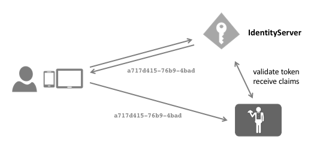

引用令牌(Reference Tokens)
================
访问令牌可以有两种形式 - 独立的或引用的。

JWT 令牌将是一个自包含的访问令牌 - 它是一种受保护的数据结构，具有声明和过期时间。
一旦 API 了解了密钥材料，它就可以验证自包含的令牌，而无需与发行者进行通信。
这使得 JWT 难以撤销。 它们将一直有效，直到到期。

使用引用令牌时 - IdentityServer 会将令牌的内容存储在数据存储中，并且只会将此令牌的唯一标识符返回给客户端。
然后，接收此引用的 API 必须打开与 IdentityServer 的反向通道通信以验证令牌。

您可以使用以下设置切换客户端的令牌类型::

    client.AccessTokenType = AccessTokenType.Reference;

IdentityServer 提供了 OAuth 2.0 自省规范的实现，它允许 API 取消引用令牌。
您可以使用我们专用的 `自省处理程序 <https://github.com/IdentityModel/IdentityModel.AspNetCore.OAuth2Introspection>`_
或使用可以验证 JWT 和引用令牌的 `Identity Server 身份验证处理程序 <https://github.com/IdentityServer/IdentityServer4.AccessTokenValidation>`_。

自省端点需要身份验证 - 由于自省端点的客户端是一个 API，您可以在 ``ApiResource`` 上配置密钥::

    var api = new ApiResource("api1")
    {
        ApiSecrets = { new Secret("secret".Sha256()) }
    }

有关如何为 API 配置 IdentityServer 身份验证中间件的更多信息，请参阅 :ref:`此处 <refProtectingApis>`。
